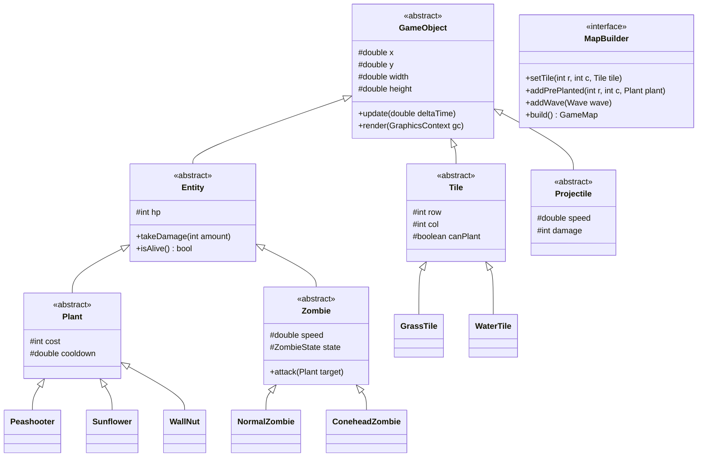

# Plants vs. Zombies - Map Builder (OOP Project)

Đồ án môn Lập trình Hướng đối tượng.

## 1. Công nghệ sử dụng (Tech Stack)
- **Ngôn ngữ:** Java (JDK 17+)
- **Đồ họa & Âm thanh:** JavaFX (Controls, Canvas, Media)
- **Quản lý build:** Maven
- **Xử lý JSON (Map Builder):** Google Gson
- **Kiểm thử:** JUnit 5

## 2. Giới thiệu
Game mô phỏng Plants vs. Zombies với 2 chế độ:
- **Play Mode:** Phòng thủ cơ bản bằng cách trồng cây chống zombie theo hàng.
- **Map Builder Mode:** Cho phép tự tạo bản đồ (chọn tile cỏ, nước, đá), đặt cây sẵn, chỉnh lượng Sun và cấu hình wave zombie, sau đó lưu ra file JSON để chơi.

## 3. Áp dụng OOP & Design Patterns
- **Đóng gói / Kế thừa / Đa hình / Trừu tượng:** Cây phả hệ `GameObject` -> `Entity` -> `Plant` / `Zombie` / `Projectile`.
- **Builder Pattern:** `MapBuilder` dựng cấu hình map từng bước từ dữ liệu hoặc editor.
- **Factory Pattern:** `PlantFactory`, `ZombieFactory` tạo đối tượng theo ID.
- **State Pattern:** Quản lý trạng thái zombie (`Walk`, `Eat`, `Dead`) và trạng thái game (`Menu`, `Playing`, `GameOver`).
- **Observer Pattern:** Bắn sự kiện va chạm, chết, nhặt Sun (`CombatEventBus`).
- **Singleton Pattern:** `ResourceManager` (load sprite/âm thanh), `GameManager`.

## 4. Phân chia công việc (5 thành viên)

### Thành viên 1: Core Engine & Bàn cờ
- `GameEngine`, `GameLoop` (vòng lặp 60 FPS update/render).
- `InputManager`: Xử lý click chuột, map tọa độ pixel sang hàng/cột.
- `GameObject`, `Entity` (lớp cơ sở cho toàn bộ game).
- `GameBoard`, `Tile` (`GrassTile`, `WaterTile`, `CraterTile`).
- `GameState` (Menu, Playing, Pause, GameOver).

### Thành viên 2: Cây trồng & Kinh tế (Sun/Cards)
- `Plant` (abstract) và các cây: `Peashooter`, `Sunflower`, `WallNut`, `SnowPea`, `CherryBomb`, `LilyPad`.
- `PlantFactory`: Khởi tạo cây theo type.
- `Sun`: Rơi ngẫu nhiên hoặc sinh từ Sunflower, logic click nhặt.
- `CardSlot`, `DeckManager`: Thanh chọn thẻ, quản lý cooldown và trừ Sun khi trồng.

### Thành viên 3: Zombie & Wave Spawner
- `Zombie` (abstract) và các loại: `NormalZombie`, `ConeheadZombie`, `BucketheadZombie`, `PoleVaultingZombie`, `WaterZombie`.
- `ZombieFactory`: Khởi tạo zombie.
- `ZombieState`: `WalkingState`, `EatingState`, `VaultingState`, `DeadState`.
- `Wave`, `WaveManager`: Đọc cấu hình đợt tấn công, canh thời gian spawn zombie và vẽ thanh tiến trình wave.

### Thành viên 4: Chiến đấu & Hiệu ứng
- `Projectile`: `PeaProjectile`, `SnowPeaProjectile` (hiệu ứng làm chậm).
- `CollisionSystem`: Kiểm tra va chạm đạn - zombie, zombie - cây, xe cắt cỏ - zombie.
- `LawnMower`: Xe cắt cỏ ở mỗi hàng.
- `ShovelTool`: Công cụ xẻng nhổ cây.
- `CombatEventBus`: Bắn event khi trúng đạn, nổ bom, zombie chết; phát âm thanh/hiệu ứng tương ứng.

### Thành viên 5: Map Builder & Lưu/Đọc File
- `MapBuilder`, `CustomMapBuilder`: Logic xây dựng map.
- `LevelDirector`: Cấu hình các map mẫu (Day, Pool).
- `MapSerializer`: Đọc / ghi file map sang JSON.
- `MapEditorController` & `MapEditorView`: Giao diện vẽ map (click chọn tile/cây -> đặt lên lưới, lưu file).
- `LevelSelectView`: Màn hình chọn map có sẵn hoặc nạp map tùy chỉnh.

## 5. Sơ đồ lớp (Class Diagram)


## 6. Cấu trúc thư mục dự án
```text
.
├── .gitignore
├── README.md
├── pom.xml
└── src/
    └── main/
        ├── java/com/pvz/
        │   ├── Main.java
        │   ├── core/           # GameEngine, GameLoop, InputManager
        │   ├── model/
        │   │   ├── base/       # GameObject, Entity
        │   │   ├── board/      # GameBoard
        │   │   ├── tile/       # Tile, GrassTile, WaterTile, CraterTile
        │   │   ├── plant/      # Plant, Peashooter, Sunflower, WallNut, ...
        │   │   ├── zombie/     # Zombie, NormalZombie, ConeheadZombie, ...
        │   │   ├── projectile/ # Projectile, Pea, SnowPea
        │   │   ├── wave/       # Wave, WaveManager
        │   │   └── economy/    # Sun, CardSlot, DeckManager
        │   ├── builder/        # MapBuilder, CustomMapBuilder, LevelDirector
        │   ├── state/          # GameState, ZombieState
        │   ├── system/         # CollisionSystem, CombatEventBus
        │   ├── io/             # MapSerializer (JSON Save/Load)
        │   └── view/           # GameCanvas, MapEditorView, HUDView
        └── resources/
            ├── assets/         # Sprites, Icons, SFX
            └── levels/         # File map mẫu (.json)
```

## 7. Quy tắc Git & Phối hợp
- **Quy ước đặt tên nhánh theo tính năng (Feature-based Branching):**
  - Tính năng mới: `feat/<ten-tinh-nang>` (ví dụ: `feat/board-grid`, `feat/peashooter-plant`, `feat/zombie-states`, `feat/collision-detection`, `feat/map-editor`).
  - Sửa lỗi: `fix/<ten-loi>` (ví dụ: `fix/bullet-offset`, `fix/cooldown-timer`).
  - Tái cấu trúc: `refactor/<module>` (ví dụ: `refactor/resource-loader`).
- **Quy trình làm việc:**
  1. Luôn tạo nhánh mới từ `main` trước khi làm một tính năng.
  2. Không commit trực tiếp vào nhánh `main`.
  3. Sau khi hoàn thành và test xong tính năng, tạo Pull Request (PR) để các thành viên khác review trước khi merge vào `main`.
