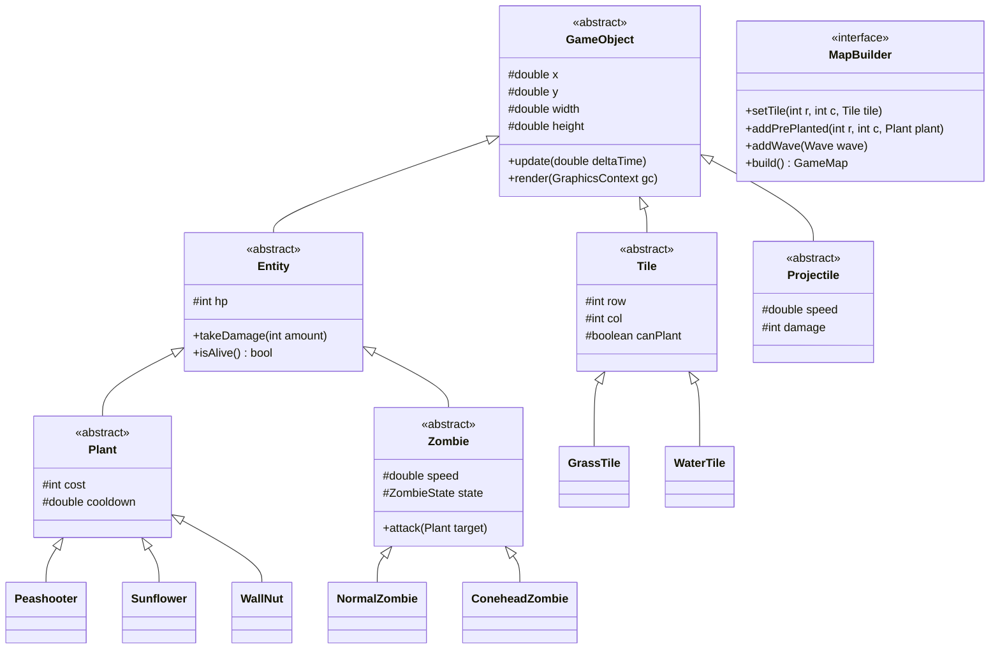

# Plants vs. Zombies - Map Builder (OOP Project)

Đồ án môn Lập trình Hướng đối tượng.

## 1. Công nghệ sử dụng (Tech Stack)
- **Ngôn ngữ:** Java (JDK 17+)
- **Đồ họa & Âm thanh:** JavaFX (Controls, Canvas, Media)
- **Quản lý build:** Maven
- **Xử lý JSON (Map Builder):** Google Gson
- **Kiểm thử:** JUnit 5

## 2. Giới thiệu
Game mô phỏng Plants vs. Zombies với 2 chế độ:
- **Play Mode:** Phòng thủ cơ bản bằng cách trồng cây chống zombie theo hàng.
- **Map Builder Mode:** Cho phép tự tạo bản đồ (chọn tile cỏ, nước, đá), đặt cây sẵn, chỉnh lượng Sun và cấu hình wave zombie, sau đó lưu ra file JSON để chơi.

## 3. Áp dụng OOP & Design Patterns
- **Đóng gói / Kế thừa / Đa hình / Trừu tượng:** Cây phả hệ `GameObject` -> `Entity` -> `Plant` / `Zombie` / `Projectile`.
- **Builder Pattern:** `MapBuilder` dựng cấu hình map từng bước từ dữ liệu hoặc editor.
- **Factory Pattern:** `PlantFactory`, `ZombieFactory` tạo đối tượng theo ID.
- **State Pattern:** Quản lý trạng thái zombie (`Walk`, `Eat`, `Dead`) và trạng thái game (`Menu`, `Playing`, `GameOver`).
- **Observer Pattern:** Bắn sự kiện va chạm, chết, nhặt Sun (`CombatEventBus`).
- **Singleton Pattern:** `ResourceManager` (load sprite/âm thanh), `GameManager`.

## 4. Phân chia công việc & Kiến thức chi tiết (5 thành viên)

### Thành viên 1: Core Engine, Grid & Trạng thái Game
- **Nhiệm vụ & Thiết kế Class:**
  - `GameObject` (abstract): Tọa độ `x`, `y`, kích thước `width`, `height`. Phương thức trừu tượng `update(double deltaTime)`, `render(GraphicsContext gc)`, `getHitbox()`.
  - `Entity` (abstract kế thừa `GameObject`): Thuộc tính `hp`, `maxHp`. Phương thức `takeDamage(int dmg)`, `isAlive()`.
  - `Tile` (abstract kế thừa `GameObject`): Tọa độ hàng `row`, cột `col`, cờ `canPlant`, `canWalk`. Các phân lớp: `GrassTile`, `WaterTile`, `CraterTile`.
  - `GameBoard`: Ma trận 2D `Tile[5][9]`, quản lý danh sách thực thể và ánh xạ pixel sang ô cờ.
  - `GameState`: Interface quản lý vòng đời game theo **State Pattern** (`MenuState`, `PlayingState`, `PauseState`, `GameOverState`).
  - `GameLoop`: Kế thừa `AnimationTimer` của JavaFX, điều phối vòng lặp game tách biệt giữa logic (`update`) và vẽ đồ họa (`render`).
- **Kiến thức kỹ thuật chi tiết cần học:**
  1. **Game Loop 60 FPS & Delta Time:** Tính toán khoảng thời gian giữa 2 khung hình (`deltaTime`) để đồng bộ tốc độ di chuyển không phụ thuộc phần cứng máy.
  2. **Toán chuyển đổi tọa độ Pixel - Grid:** Công thức ánh xạ click chuột sang ô cờ: `col = (int) ((mouseX - START_X) / CELL_WIDTH)`, `row = (int) ((mouseY - START_Y) / CELL_HEIGHT)`.
  3. **Mẫu thiết kế State & Singleton:** Xây dựng máy trạng thái game và triển khai Singleton cho `GameManager`.
  4. **JavaFX Canvas Rendering:** Quản lý `GraphicsContext`, kỹ thuật xóa khung hình `gc.clearRect()` và vẽ theo lớp (Layer rendering).
- **Nguồn tài liệu chuyên sâu:**
  - [JavaFX AnimationTimer & Game Loop Guide](https://openjfx.io)
  - [Refactoring Guru: State Pattern in Java](https://refactoring.guru/design-patterns/state/java/example)
  - [Refactoring Guru: Singleton Pattern](https://refactoring.guru/design-patterns/singleton/java/example)
  - [Baeldung: Multidimensional Arrays in Java](https://www.baeldung.com/java-two-dimensional-arrays)

### Thành viên 2: Hệ sinh thái Cây trồng & Kinh tế Mặt trời
- **Nhiệm vụ & Thiết kế Class:**
  - `Plant` (abstract kế thừa `Entity`): Thuộc tính `cost`, `cooldown`, `attackSpeed`.
  - Các phân lớp cụ thể: `Sunflower` (đếm thời gian sinh Sun), `Peashooter` (quét zombie trên hàng để bắn đậu), `SnowPea` (bắn đậu băng làm chậm), `WallNut` (máu cao chắn đường), `CherryBomb` (nổ diện rộng 3x3), `LilyPad` (bèo đệm trên nước).
  - `PlantFactory`: Triển khai **Factory Method Pattern** để tạo cây theo tên/loại.
  - `Sun`: Vật phẩm năng lượng, rơi ngẫu nhiên từ trời hoặc mọc từ Sunflower. Xử lý click chuột để nhặt và cộng dồn điểm.
  - `CardSlot` & `DeckManager`: Thanh chọn cây, tính toán thời gian hồi chiêu (lớp phủ Cooldown Overlay), kiểm tra số dư Sun để cho phép trồng.
- **Kiến thức kỹ thuật chi tiết cần học:**
  1. **Kế thừa đa cấp & Tính đa hình (Polymorphism):** Mở rộng thêm cây mới mà không sửa logic cũ (Open/Closed Principle).
  2. **Quản lý Cooldown & Bộ đếm thời gian:** Xây dựng `CooldownTimer` dựa trên delta time, chuẩn hóa tỷ lệ hiển thị thanh hồi chiêu.
  3. **Thuật toán Hit Test click chuột:** Nhận diện click trúng hạt mặt trời đang rơi bằng bounding box.
  4. **Mẫu thiết kế Factory Method:** Tách rời logic tạo cây ra khỏi luồng điều khiển của bàn cờ.
- **Nguồn tài liệu chuyên sâu:**
  - [Refactoring Guru: Factory Method Pattern](https://refactoring.guru/design-patterns/factory-method/java/example)
  - [Game Programming Patterns: Game Loop & Delta Time](https://gameprogrammingpatterns.com/game-loop.html)
  - [Oracle Java: Abstract Methods and Classes](https://docs.oracle.com/javase/tutorial/java/IandI/abstract.html)
  - [Jenkov: JavaFX Mouse Event Handling](https://jenkov.com/tutorials/javafx/events.html)

### Thành viên 3: Zombie AI, State Machine & Wave Spawner
- **Nhiệm vụ & Thiết kế Class:**
  - `Zombie` (abstract kế thừa `Entity`): Thuộc tính `speed`, `attackDamage`, `currentLane`, `state`.
  - Phân lớp Zombie: `NormalZombie` (cơ bản), `ConeheadZombie` / `BucketheadZombie` (quản lý giáp phụ Armor HP, đổi sprite khi vỡ giáp), `PoleVaultingZombie` (cầm sào nhảy vượt qua cây đầu tiên), `WaterZombie` (chuyển sang bơi khi gặp ô nước).
  - **State Pattern cho Zombie:** Interface `ZombieState` (`WalkingState`, `EatingState`, `VaultingState`, `DeadState`).
  - `Wave`: Chứa danh sách zombie, hàng xuất hiện (lane) và thời gian trễ.
  - `WaveManager`: Điều phối nhịp độ đợt quái, phát tín hiệu cờ báo hiệu đợt quái lớn (Huge Wave).
- **Kiến thức kỹ thuật chi tiết cần học:**
  1. **Máy trạng thái hữu hạn (Finite State Machine - FSM):** Tách biệt hành vi và chuyển giao trạng thái mượt mà của Zombie mà không dùng chuỗi `if-else` lồng nhau.
  2. **Quản lý danh sách động & Safe Removal:** Sử dụng `Iterator<Zombie>` để loại bỏ an toàn các quái vật đã chết (`!zombie.isAlive()`), tránh ngoại lệ `ConcurrentModificationException`.
  3. **Lập lịch xuất hiện sự kiện (Event Scheduling):** Dùng bộ đếm thời gian tích lũy để kích hoạt đợt quái đúng thời điểm kịch bản.
- **Nguồn tài liệu chuyên sâu:**
  - [Game Programming Patterns: State Machine in Game](https://gameprogrammingpatterns.com/state.html)
  - [Refactoring Guru: State Pattern Comprehensive Guide](https://refactoring.guru/design-patterns/state)
  - [Baeldung: Correct Removal in Java Collections](https://www.baeldung.com/java-concurrentmodificationexception)

### Thành viên 4: Hệ thống Chiến đấu, Va chạm & Hiệu ứng Âm thanh
- **Nhiệm vụ & Thiết kế Class:**
  - `Projectile` (abstract kế thừa `GameObject`): Thuộc tính `speed`, `damage`, `lane`. Phân lớp: `PeaProjectile` (đạn thường), `SnowPeaProjectile` (đạn băng làm chậm 50%).
  - `CollisionSystem`:
    - Thuật toán kiểm tra va chạm Hitbox AABB giữa Đạn - Zombie trên cùng hàng.
    - Kiểm tra khoảng cách Zombie - Cây để chuyển sang trạng thái ăn cây.
    - Kiểm tra va chạm Xe cắt cỏ - Zombie.
  - `LawnMower`: Xe cắt cỏ ở đầu mỗi hàng (`x = 0`), tự kích hoạt khi có zombie chạm vào, di chuyển nhanh dọn sạch hàng đó.
  - `ShovelTool`: Công cụ xẻng nhổ cây, giải phóng ô đất.
  - `CombatEventBus` (**Observer Pattern**): Phát và nhận các sự kiện: `BulletHitEvent`, `ZombieDeathEvent`, `BombExplosionEvent`.
  - `SoundManager`: Nạp trước và phát các hiệu ứng âm thanh `.wav` (tiếng bắn, tiếng quái cắn, tiếng nổ) bằng `AudioClip` của JavaFX.
- **Kiến thức kỹ thuật chi tiết cần học:**
  1. **Thuật toán va chạm 2D Axis-Aligned Bounding Box (AABB):** Kiểm tra giao thoa giữa 2 hình hộp chữ nhật theo trục tọa độ.
  2. **Mẫu thiết kế Observer (Publish-Subscribe):** Tách rời hệ thống va chạm với hệ thống âm thanh và đồ họa.
  3. **Âm thanh độ trễ thấp (Low-Latency Audio):** Dùng JavaFX `AudioClip` nạp sẵn âm thanh vào RAM để phát tức thời không bị giật lag.
- **Nguồn tài liệu chuyên sâu:**
  - [MDN: 2D Collision Detection Techniques (AABB)](https://developer.mozilla.org/en-US/docs/Games/Techniques/2D_collision_detection)
  - [Refactoring Guru: Observer Pattern in Java](https://refactoring.guru/design-patterns/observer/java/example)
  - [Oracle JavaFX AudioClip Class Reference](https://openjfx.io/javadoc/21/javafx.media/javafx/scene/media/AudioClip.html)

### Thành viên 5: Map Builder Engine, Lưu/Đọc File & Trình soạn thảo GUI
- **Nhiệm vụ & Thiết kế Class:**
  - `MapBuilder` (interface định nghĩa các bước dựng map) & `CustomMapBuilder` (hiện thực chi tiết **Builder Pattern**).
  - `LevelDirector`: Xây dựng sẵn các kịch bản màn chơi mẫu (Stage Ban ngày, Stage Bể bơi).
  - `MapSerializer`: Đọc và ghi dữ liệu cấu hình bản đồ sang định dạng JSON sử dụng thư viện **Google Gson**.
  - `MapEditorController` & `MapEditorView`: Giao diện thiết kế bản đồ (thanh Palette chọn loại đất, click đặt lên bàn cờ, nhập số Sun, lưu file).
  - `LevelSelectView`: Màn hình chọn chơi màn mặc định hoặc nạp file bản đồ tự chế.
- **Kiến thức kỹ thuật chi tiết cần học:**
  1. **Mẫu thiết kế Builder (GoF):** Tách rời quá trình khởi tạo cấu hình bản đồ phức tạp, áp dụng Method Chaining (`return this;`).
  2. **Xử lý Serialization với Google Gson:** Kỹ thuật chuyển đổi cấu trúc đối tượng phức tạp (`GameMap`) thành file văn bản JSON và ngược lại.
  3. **Xây dựng UI tương tác trong JavaFX:** Quản lý giao diện bằng các layout container (`BorderPane`, `VBox`), bắt sự kiện nút bấm (`setOnAction`) và click chuột trên Canvas.
- **Nguồn tài liệu chuyên sâu:**
  - [Refactoring Guru: Builder Pattern in Java](https://refactoring.guru/design-patterns/builder/java/example)
  - [Baeldung: Complete Guide to Google Gson Serialization](https://www.baeldung.com/gson-deserialization-guide)
  - [Jenkov: JavaFX Layout Containers Tutorial](https://jenkov.com/tutorials/javafx/layout-containers.html)

## 5. Sơ đồ lớp (Class Diagram)


## 6. Cấu trúc thư mục dự án
```text
.gitignore
README.md
pom.xml
src/
└── main/
    ├── java/com/pvz/
    │   ├── Main.java
    │   ├── core/           # GameEngine, GameLoop, InputManager
    │   ├── model/
    │   │   ├── base/       # GameObject, Entity
    │   │   ├── board/      # GameBoard
    │   │   ├── tile/       # Tile, GrassTile, WaterTile, CraterTile
    │   │   ├── plant/      # Plant, Peashooter, Sunflower, WallNut, ...
    │   │   ├── zombie/     # Zombie, NormalZombie, ConeheadZombie, ...
    │   │   ├── projectile/ # Projectile, Pea, SnowPea
    │   │   ├── wave/       # Wave, WaveManager
    │   │   └── economy/    # Sun, CardSlot, DeckManager
    │   ├── builder/        # MapBuilder, CustomMapBuilder, LevelDirector
    │   ├── state/          # GameState, ZombieState
    │   ├── system/         # CollisionSystem, CombatEventBus
    │   ├── io/             # MapSerializer (JSON Save/Load)
    │   └── view/           # GameCanvas, MapEditorView, HUDView
    └── resources/
        ├── assets/         # Sprites, Icons, SFX
        └── levels/         # File map mẫu (.json)
```

## 7. Quy tắc Git & Phối hợp
- **Quy ước đặt tên nhánh theo tính năng (Feature-based Branching):**
  - Tính năng mới: `feat/<ten-tinh-nang>` (ví dụ: `feat/board-grid`, `feat/peashooter-plant`, `feat/zombie-states`, `feat/collision-detection`, `feat/map-editor`).
  - Sửa lỗi: `fix/<ten-loi>` (ví dụ: `fix/bullet-offset`, `fix/cooldown-timer`).
  - Tái cấu trúc: `refactor/<module>` (ví dụ: `refactor/resource-loader`).
- **Quy trình làm việc:**
  1. Luôn tạo nhánh mới từ `main` trước khi làm một tính năng.
  2. Không commit trực tiếp vào nhánh `main`.
  3. Sau khi hoàn thành và test xong tính năng, tạo Pull Request (PR) để các thành viên khác review trước khi merge vào `main`.
