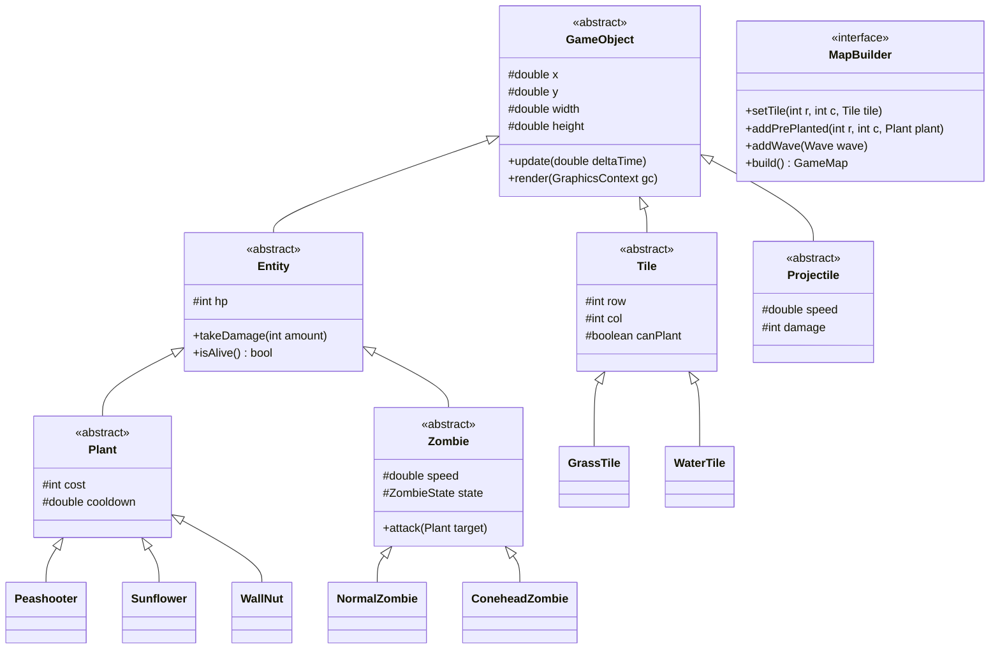

# Plants vs. Zombies - Map Builder (OOP Project)

Đồ án môn Lập trình Hướng đối tượng.

## 1. Công nghệ sử dụng (Tech Stack)
- **Ngôn ngữ:** Java (JDK 17+)
- **Đồ họa & Âm thanh:** JavaFX (Controls, Canvas, Media)
- **Quản lý build:** Maven
- **Xử lý JSON (Map Builder):** Google Gson
- **Kiểm thử:** JUnit 5

## 2. Giới thiệu
Game mô phỏng Plants vs. Zombies với 2 chế độ:
- **Play Mode:** Phòng thủ cơ bản bằng cách trồng cây chống zombie theo hàng.
- **Map Builder Mode:** Cho phép tự tạo bản đồ (chọn tile cỏ, nước, đá), đặt cây sẵn, chỉnh lượng Sun và cấu hình wave zombie, sau đó lưu ra file JSON để chơi.

## 3. Áp dụng OOP & Design Patterns
- **Đóng gói / Kế thừa / Đa hình / Trừu tượng:** Cây phả hệ `GameObject` -> `Entity` -> `Plant` / `Zombie` / `Projectile`.
- **Builder Pattern:** `MapBuilder` dựng cấu hình map từng bước từ dữ liệu hoặc editor.
- **Factory Pattern:** `PlantFactory`, `ZombieFactory` tạo đối tượng theo ID.
- **State Pattern:** Quản lý trạng thái zombie (`Walk`, `Eat`, `Dead`) và trạng thái game (`Menu`, `Playing`, `GameOver`).
- **Observer Pattern:** Bắn sự kiện va chạm, chết, nhặt Sun (`CombatEventBus`).
- **Singleton Pattern:** `ResourceManager` (load sprite/âm thanh), `GameManager`.

## 4. Phân chia công việc & Kiến thức chi tiết (5 thành viên)

### Thành viên 1: Core Engine, Grid & Trạng thái Game (Trung)
- **Nhiệm vụ & Thiết kế Class:**
  - `GameObject` (abstract): Tọa độ `x`, `y`, kích thước `width`, `height`. Phương thức trừu tượng `update(double deltaTime)`, `render(GraphicsContext gc)`, `getHitbox()`.
  - `Entity` (abstract kế thừa `GameObject`): Thuộc tính `hp`, `maxHp`. Phương thức `takeDamage(int dmg)`, `isAlive()`.
  - `Tile` (abstract kế thừa `GameObject`): Tọa độ hàng `row`, cột `col`, cờ `canPlant`, `canWalk`. Các phân lớp: `GrassTile`, `WaterTile`, `CraterTile`.
  - `GameBoard`: Ma trận 2D `Tile[5][9]`, quản lý danh sách thực thể và ánh xạ pixel sang ô cờ.
  - `GameState`: Interface quản lý vòng đời game theo **State Pattern** (`MenuState`, `PlayingState`, `PauseState`, `GameOverState`).
  - `GameLoop`: Kế thừa `AnimationTimer` của JavaFX, điều phối vòng lặp game tách biệt giữa logic (`update`) và vẽ đồ họa (`render`).
- **Kiến thức kỹ thuật chi tiết cần học:**
  1. **Game Loop 60 FPS & Delta Time:** Tính toán khoảng thời gian giữa 2 khung hình (`deltaTime`) để đồng bộ tốc độ di chuyển không phụ thuộc phần cứng máy.
  2. **Toán chuyển đổi tọa độ Pixel - Grid:** Công thức ánh xạ click chuột sang ô cờ: `col = (int) ((mouseX - START_X) / CELL_WIDTH)`, `row = (int) ((mouseY - START_Y) / CELL_HEIGHT)`.
  3. **Mẫu thiết kế State & Singleton:** Xây dựng máy trạng thái game và triển khai Singleton cho `GameManager`.
  4. **JavaFX Canvas Rendering:** Quản lý `GraphicsContext`, kỹ thuật xóa khung hình `gc.clearRect()` và vẽ theo lớp (Layer rendering).
- **Nguồn tài liệu chuyên sâu:**
  - [JavaFX AnimationTimer & Game Loop Guide](https://openjfx.io)
  - [Refactoring Guru: State Pattern in Java](https://refactoring.guru/design-patterns/state/java/example)
  - [Refactoring Guru: Singleton Pattern](https://refactoring.guru/design-patterns/singleton/java/example)
  - [Baeldung: Multidimensional Arrays in Java](https://www.baeldung.com/java-two-dimensional-arrays)

### Thành viên 2: Hệ sinh thái Cây trồng & Kinh tế Mặt trời (An Nguyên)
- **Nhiệm vụ & Thiết kế Class:**
  - `Plant` (abstract kế thừa `Entity`): Thuộc tính `cost`, `cooldown`, `attackSpeed`.
  - Các phân lớp cụ thể: `Sunflower` (đếm thời gian sinh Sun), `Peashooter` (quét zombie trên hàng để bắn đậu), `SnowPea` (bắn đậu băng làm chậm), `WallNut` (máu cao chắn đường), `CherryBomb` (nổ diện rộng 3x3), `LilyPad` (bèo đệm trên nước).
  - `PlantFactory`: Triển khai **Factory Method Pattern** để tạo cây theo tên/loại.
  - `Sun`: Vật phẩm năng lượng, rơi ngẫu nhiên từ trời hoặc mọc từ Sunflower. Xử lý click chuột để nhặt và cộng dồn điểm.
  - `CardSlot` & `DeckManager`: Thanh chọn cây, tính toán thời gian hồi chiêu (lớp phủ Cooldown Overlay), kiểm tra số dư Sun để cho phép trồng.
- **Kiến thức kỹ thuật chi tiết cần học:**
  1. **Kế thừa đa cấp & Tính đa hình (Polymorphism):** Mở rộng thêm cây mới mà không sửa logic cũ (Open/Closed Principle).
  2. **Quản lý Cooldown & Bộ đếm thời gian:** Xây dựng `CooldownTimer` dựa trên delta time, chuẩn hóa tỷ lệ hiển thị thanh hồi chiêu.
  3. **Thuật toán Hit Test click chuột:** Nhận diện click trúng hạt mặt trời đang rơi bằng bounding box.
  4. **Mẫu thiết kế Factory Method:** Tách rời logic tạo cây ra khỏi luồng điều khiển của bàn cờ.
- **Nguồn tài liệu chuyên sâu:**
  - [Refactoring Guru: Factory Method Pattern](https://refactoring.guru/design-patterns/factory-method/java/example)
  - [Game Programming Patterns: Game Loop & Delta Time](https://gameprogrammingpatterns.com/game-loop.html)
  - [Oracle Java: Abstract Methods and Classes](https://docs.oracle.com/javase/tutorial/java/IandI/abstract.html)
  - [Jenkov: JavaFX Mouse Event Handling](https://jenkov.com/tutorials/javafx/events.html)

### Thành viên 3: Zombie AI, State Machine & Wave Spawner (Ngọc Minh)
- **Nhiệm vụ & Thiết kế Class:**
  - `Zombie` (abstract kế thừa `Entity`): Thuộc tính `speed`, `attackDamage`, `currentLane`, `state`.
  - Phân lớp Zombie: `NormalZombie` (cơ bản), `ConeheadZombie` / `BucketheadZombie` (quản lý giáp phụ Armor HP, đổi sprite khi vỡ giáp), `PoleVaultingZombie` (cầm sào nhảy vượt qua cây đầu tiên), `WaterZombie` (chuyển sang bơi khi gặp ô nước).
  - **State Pattern cho Zombie:** Interface `ZombieState` (`WalkingState`, `EatingState`, `VaultingState`, `DeadState`).
  - `Wave`: Chứa danh sách zombie, hàng xuất hiện (lane) và thời gian trễ.
  - `WaveManager`: Điều phối nhịp độ đợt quái, phát tín hiệu cờ báo hiệu đợt quái lớn (Huge Wave).
- **Kiến thức kỹ thuật chi tiết cần học:**
  1. **Máy trạng thái hữu hạn (Finite State Machine - FSM):** Tách biệt hành vi và chuyển giao trạng thái mượt mà của Zombie mà không dùng chuỗi `if-else` lồng nhau.
  2. **Quản lý danh sách động & Safe Removal:** Sử dụng `Iterator<Zombie>` để loại bỏ an toàn các quái vật đã chết (`!zombie.isAlive()`), tránh ngoại lệ `ConcurrentModificationException`.
  3. **Lập lịch xuất hiện sự kiện (Event Scheduling):** Dùng bộ đếm thời gian tích lũy để kích hoạt đợt quái đúng thời điểm kịch bản.
- **Nguồn tài liệu chuyên sâu:**
  - [Game Programming Patterns: State Machine in Game](https://gameprogrammingpatterns.com/state.html)
  - [Refactoring Guru: State Pattern Comprehensive Guide](https://refactoring.guru/design-patterns/state)
  - [Baeldung: Correct Removal in Java Collections](https://www.baeldung.com/java-concurrentmodificationexception)

### Thành viên 4: Hệ thống Chiến đấu, Va chạm & Hiệu ứng Âm thanh (Tuấn Minh)
- **Nhiệm vụ & Thiết kế Class:**
  - `Projectile` (abstract kế thừa `GameObject`): Thuộc tính `speed`, `damage`, `lane`. Phân lớp: `PeaProjectile` (đạn thường), `SnowPeaProjectile` (đạn băng làm chậm 50%).
  - `CollisionSystem`:
    - Thuật toán kiểm tra va chạm Hitbox AABB giữa Đạn - Zombie trên cùng hàng.
    - Kiểm tra khoảng cách Zombie - Cây để chuyển sang trạng thái ăn cây.
    - Kiểm tra va chạm Xe cắt cỏ - Zombie.
  - `LawnMower`: Xe cắt cỏ ở đầu mỗi hàng (`x = 0`), tự kích hoạt khi có zombie chạm vào, di chuyển nhanh dọn sạch hàng đó.
  - `ShovelTool`: Công cụ xẻng nhổ cây, giải phóng ô đất.
  - `CombatEventBus` (**Observer Pattern**): Phát và nhận các sự kiện: `BulletHitEvent`, `ZombieDeathEvent`, `BombExplosionEvent`.
  - `SoundManager`: Nạp trước và phát các hiệu ứng âm thanh `.wav` (tiếng bắn, tiếng quái cắn, tiếng nổ) bằng `AudioClip` của JavaFX.
- **Kiến thức kỹ thuật chi tiết cần học:**
  1. **Thuật toán va chạm 2D Axis-Aligned Bounding Box (AABB):** Kiểm tra giao thoa giữa 2 hình hộp chữ nhật theo trục tọa độ.
  2. **Mẫu thiết kế Observer (Publish-Subscribe):** Tách rời hệ thống va chạm với hệ thống âm thanh và đồ họa.
  3. **Âm thanh độ trễ thấp (Low-Latency Audio):** Dùng JavaFX `AudioClip` nạp sẵn âm thanh vào RAM để phát tức thời không bị giật lag.
- **Nguồn tài liệu chuyên sâu:**
  - [MDN: 2D Collision Detection Techniques (AABB)](https://developer.mozilla.org/en-US/docs/Games/Techniques/2D_collision_detection)
  - [Refactoring Guru: Observer Pattern in Java](https://refactoring.guru/design-patterns/observer/java/example)
  - [Oracle JavaFX AudioClip Class Reference](https://openjfx.io/javadoc/21/javafx.media/javafx/scene/media/AudioClip.html)

### Thành viên 5: Map Builder Engine, Lưu/Đọc File & Trình soạn thảo GUI (Quang)
- **Nhiệm vụ & Thiết kế Class:**
  - `MapBuilder` (interface định nghĩa các bước dựng map) & `CustomMapBuilder` (hiện thực chi tiết **Builder Pattern**).
  - `LevelDirector`: Xây dựng sẵn các kịch bản màn chơi mẫu (Stage Ban ngày, Stage Bể bơi).
  - `MapSerializer`: Đọc và ghi dữ liệu cấu hình bản đồ sang định dạng JSON sử dụng thư viện **Google Gson**.
  - `MapEditorController` & `MapEditorView`: Giao diện thiết kế bản đồ (thanh Palette chọn loại đất, click đặt lên bàn cờ, nhập số Sun, lưu file).
  - `LevelSelectView`: Màn hình chọn chơi màn mặc định hoặc nạp file bản đồ tự chế.
- **Kiến thức kỹ thuật chi tiết cần học:**
  1. **Mẫu thiết kế Builder (GoF):** Tách rời quá trình khởi tạo cấu hình bản đồ phức tạp, áp dụng Method Chaining (`return this;`).
  2. **Xử lý Serialization với Google Gson:** Kỹ thuật chuyển đổi cấu trúc đối tượng phức tạp (`GameMap`) thành file văn bản JSON và ngược lại.
  3. **Xây dựng UI tương tác trong JavaFX:** Quản lý giao diện bằng các layout container (`BorderPane`, `VBox`), bắt sự kiện nút bấm (`setOnAction`) và click chuột trên Canvas.
- **Nguồn tài liệu chuyên sâu:**
  - [Refactoring Guru: Builder Pattern in Java](https://refactoring.guru/design-patterns/builder/java/example)
  - [Baeldung: Complete Guide to Google Gson Serialization](https://www.baeldung.com/gson-deserialization-guide)
  - [Jenkov: JavaFX Layout Containers Tutorial](https://jenkov.com/tutorials/javafx/layout-containers.html)

## 5. Sơ đồ lớp (Class Diagram)


## 6. Cấu trúc thư mục dự án (Thiết kế kiến trúc dài hạn - Long-term Architecture)

Dự án được tổ chức theo kiến trúc phân tầng chuẩn Maven (**Layered & Modular Architecture**), hướng tới tính mở rộng cao (Open/Closed Principle): dễ dàng bổ sung cây mới, zombie mới, địa hình mới và cơ chế map mới mà không phá vỡ logic lõi của Game Engine.

```text
.gitignore
README.md
pom.xml
src/
├── main/
│   ├── java/com/pvz/
│   │   ├── Main.java                                   # Điểm khởi chạy ứng dụng JavaFX
│   │   │
│   │   ├── core/                                       # [Trung] Core Engine & Vòng đời game
│   │   │   ├── GameEngine.java                         # Bộ điều phối luồng game chính
│   │   │   ├── GameLoop.java                           # AnimationTimer 60 FPS, tính delta-time
│   │   │   ├── GameManager.java                        # Singleton quản trị phiên chơi hiện tại
│   │   │   └── InputManager.java                       # Bắt và phân luồng sự kiện bàn phím/chuột
│   │   │
│   │   ├── model/                                      # Mô hình dữ liệu & Thực thể OOP
│   │   │   ├── base/                                   # [Trung] Lớp trừu tượng nền tảng
│   │   │   │   ├── GameObject.java                     # Tọa độ (x, y), kích thước, update, render
│   │   │   │   ├── Entity.java                         # Máu (hp, maxHp), takeDamage, isAlive
│   │   │   │   └── Direction.java                      # Enum hướng di chuyển
│   │   │   │
│   │   │   ├── board/                                  # [Trung] Ma trận bàn cờ
│   │   │   │   ├── GameBoard.java                      # Quản lý lưới 5x9, chuyển đổi Pixel <-> Grid
│   │   │   │   └── Lane.java                           # Quản lý từng hàng riêng biệt (hàng cờ)
│   │   │   │
│   │   │   ├── tile/                                   # [Trung] Hệ thống ô đất địa hình
│   │   │   │   ├── Tile.java                           # Lớp trừu tượng ô cờ (row, col, canPlant)
│   │   │   │   ├── GrassTile.java                      # Đất cỏ thông thường
│   │   │   │   ├── WaterTile.java                      # Mặt nước (yêu cầu LilyPad)
│   │   │   │   ├── CraterTile.java                     # Hố bom/đất lún (không thể trồng cây)
│   │   │   │   └── TileType.java                       # Enum phân loại ô đất
│   │   │   │
│   │   │   ├── plant/                                  # [An Nguyên] Hệ sinh thái Cây trồng
│   │   │   │   ├── Plant.java                          # Lớp trừu tượng cây (cost, cooldown, attack)
│   │   │   │   ├── PlantType.java                      # Enum danh sách loại cây
│   │   │   │   ├── PlantFactory.java                   # Factory Method khởi tạo cây theo ID
│   │   │   │   ├── attack/                             # Nhóm cây tấn công
│   │   │   │   │   ├── Peashooter.java                 # Bắn đậu xanh thẳng hàng
│   │   │   │   │   ├── SnowPea.java                    # Bắn đậu băng làm chậm
│   │   │   │   │   └── Repeater.java                   # Bắn 2 phát liên tiếp (mở rộng tương lai)
│   │   │   │   ├── producer/                           # Nhóm cây sản xuất tài nguyên
│   │   │   │   │   └── Sunflower.java                  # Định kỳ sinh mặt trời (Sun)
│   │   │   │   ├── defense/                            # Nhóm cây phòng thủ / chắn đường
│   │   │   │   │   └── WallNut.java                    # Máu cực dày, đổi sprite khi nứt vỡ
│   │   │   │   ├── instant/                            # Nhóm cây dùng 1 lần (bom nổ)
│   │   │   │   │   └── CherryBomb.java                 # Kích nổ 3x3 sau 1.2s
│   │   │   │   └── support/                            # Nhóm cây hỗ trợ môi trường
│   │   │   │       └── LilyPad.java                    # Đệm đặt trên WaterTile để trồng cây khác
│   │   │   │
│   │   │   ├── zombie/                                 # [Ngọc Minh] Chủng loại Zombie & AI
│   │   │   │   ├── Zombie.java                         # Lớp trừu tượng Zombie (speed, dmg, lane)
│   │   │   │   ├── ZombieType.java                     # Enum danh sách zombie
│   │   │   │   ├── ZombieFactory.java                  # Factory Method khởi tạo quái
│   │   │   │   ├── basic/                              # Zombie cơ bản
│   │   │   │   │   ├── NormalZombie.java               # Zombie dân làng đi bộ
│   │   │   │   │   └── FlagZombie.java                 # Cầm cờ dẫn đầu Huge Wave
│   │   │   │   ├── armored/                            # Zombie có giáp chắn
│   │   │   │   │   ├── ConeheadZombie.java             # Đội nón giao thông (+Armor HP)
│   │   │   │   │   └── BucketheadZombie.java           # Đội xô sắt (+High Armor HP)
│   │   │   │   ├── special/                            # Zombie có kỹ năng đặc biệt
│   │   │   │   │   └── PoleVaultingZombie.java         # Cầm sào nhảy vượt cây đầu tiên
│   │   │   │   └── aquatic/                            # Zombie bơi nước
│   │   │   │       └── WaterZombie.java                # Đi phao vịt lội trên WaterTile
│   │   │   │
│   │   │   ├── projectile/                             # [Tuấn Minh] Hệ thống đường đạn
│   │   │   │   ├── Projectile.java                     # Lớp trừu tượng đạn (x, y, speed, dmg, lane)
│   │   │   │   ├── PeaProjectile.java                  # Đạn đậu thường
│   │   │   │   ├── SnowPeaProjectile.java              # Đạn băng (hiệu ứng Slow 50%)
│   │   │   │   └── ProjectileType.java                 # Enum phân loại đạn
│   │   │   │
│   │   │   ├── wave/                                   # [Ngọc Minh] Đợt quái & Kịch bản màn chơi
│   │   │   │   ├── Wave.java                           # Danh sách zombie, lane và thời gian trễ
│   │   │   │   ├── WaveManager.java                    # Quản lý nhịp độ đợt quái, phát Huge Wave
│   │   │   │   └── WaveEntry.java                      # Cấu hình từng quái lẻ trong wave
│   │   │   │
│   │   │   └── economy/                                # [An Nguyên] Kinh tế tài nguyên & Thẻ bài
│   │   │       ├── Sun.java                            # Mặt trời rơi/sinh ra, click để nhặt
│   │   │       ├── SunSpawner.java                     # Tự động thả mặt trời ngẫu nhiên từ trời
│   │   │       ├── CardSlot.java                       # Ô thẻ cây (hiển thị cooldown overlay, số dư sun)
│   │   │       ├── CooldownTimer.java                  # Bộ đếm thời gian hồi chiêu từng loại hạt giống
│   │   │       └── DeckManager.java                    # Thanh lựa chọn hạt giống (Seed Bank)
│   │   │
│   │   ├── state/                                      # [Trung & Ngọc Minh] State Pattern (Máy trạng thái)
│   │   │   ├── game/                                   # [Trung] Trạng thái vòng đời trò chơi
│   │   │   │   ├── GameState.java                      # Interface trạng thái game (enter, update, exit)
│   │   │   │   ├── MenuState.java                      # Màn hình chính
│   │   │   │   ├── PlayingState.java                   # Trong trận chiến
│   │   │   │   ├── PauseState.java                     # Tạm dừng trận đấu
│   │   │   │   ├── VictoryState.java                   # Chiến thắng màn chơi
│   │   │   │   └── GameOverState.java                  # Zombie tràn vào nhà (Game Over)
│   │   │   │
│   │   │   └── zombie/                                 # [Ngọc Minh] Máy trạng thái hành vi Zombie (FSM)
│   │   │       ├── ZombieState.java                    # Interface hành vi
│   │   │       ├── WalkingState.java                   # Đang bước đi tiến về bên trái
│   │   │       ├── EatingState.java                    # Đang gặm cây ở ô phía trước
│   │   │       ├── VaultingState.java                  # Đang kích hoạt kỹ năng nhảy qua cây
│   │   │       ├── SwimmingState.java                  # Đang bơi trên ô nước
│   │   │       └── DeadState.java                      # Trạng thái gục ngã / tan biến
│   │   │
│   │   ├── system/                                     # [Tuấn Minh] Hệ thống xử lý chiến đấu & Tiện ích
│   │   │   ├── collision/                              # Hệ thống va chạm
│   │   │   │   ├── CollisionSystem.java                # Thuật toán quét va chạm AABB theo hàng
│   │   │   │   └── Hitbox.java                         # Bounding box tọa độ kiểm tra giao thoa
│   │   │   │
│   │   │   ├── defense/                                # Cơ chế cứu nguy hàng thủ
│   │   │   │   ├── LawnMower.java                      # Xe cắt cỏ đặt đầu mỗi hàng (bảo hiểm cuối)
│   │   │   │   └── ShovelTool.java                     # Chiếc xẻng đào cây để trống ô
│   │   │   │
│   │   │   ├── audio/                                  # Hệ thống âm thanh độ trễ thấp
│   │   │   │   ├── SoundManager.java                   # Phát SFX qua JavaFX AudioClip
│   │   │   │   └── MusicPlayer.java                    # Phát nhạc nền BGM (lặp vô tận)
│   │   │   │
│   │   │   ├── effect/                                 # Hiệu ứng thị giác (VFX)
│   │   │   │   ├── EffectManager.java                  # Quản lý vòng đời hiệu ứng tạm thời
│   │   │   │   └── ParticleEffect.java                 # Hiệu ứng nổ bom 3x3, mảnh vỡ đậu, băng làm chậm
│   │   │   │
│   │   │   ├── resource/                               # Quản lý tài nguyên tập trung (Cache RAM)
│   │   │   │   └── ResourceManager.java                # Singleton load và giữ trước Sprite, Âm thanh
│   │   │   │
│   │   │   └── event/                                  # [Tuấn Minh] Observer Pattern (Sự kiện chiến đấu)
│   │   │       ├── GameEvent.java                      # Lớp sự kiện gốc
│   │   │       ├── CombatEventBus.java                 # Trung tâm phát/nhận sự kiện (Publish-Subscribe)
│   │   │       ├── CombatListener.java                 # Interface lắng nghe
│   │   │       ├── BulletHitEvent.java                 # Đạn trúng zombie
│   │   │       ├── ZombieDeathEvent.java               # Zombie bị tiêu diệt
│   │   │       ├── BombExplosionEvent.java             # Bom nổ diện rộng 3x3
│   │   │       ├── PlantEatenEvent.java                # Cây bị zombie ăn mất
│   │   │       └── SunCollectedEvent.java              # Nhặt được Sun cộng điểm
│   │   │
│   │   ├── builder/                                    # [Quang] Builder Pattern (Dựng bản đồ)
│   │   │   ├── MapBuilder.java                         # Interface định nghĩa các bước xây map
│   │   │   ├── CustomMapBuilder.java                   # Triển khai Builder chi tiết (Method Chaining)
│   │   │   ├── LevelDirector.java                      # Director chứa kịch bản dựng map mẫu có sẵn
│   │   │   └── GameMap.java                            # Đối tượng bản đồ hoàn chỉnh chứa Grid, Sun, Wave
│   │   │
│   │   ├── io/                                         # [Quang] Lưu & Nạp dữ liệu JSON (Google Gson)
│   │   │   ├── MapSerializer.java                      # Đọc / Ghi file JSON cấu hình bản đồ
│   │   │   ├── LevelDataLoader.java                    # Quét nạp danh sách map có trong thư mục
│   │   │   └── dto/                                    # Data Transfer Objects hỗ trợ Gson ánh xạ
│   │   │       ├── MapConfigDTO.java                   # Cấu trúc JSON cho map
│   │   │       └── WaveConfigDTO.java                  # Cấu trúc JSON cho wave
│   │   │
│   │   └── view/                                       # [Quang & Trung] Giao diện người dùng JavaFX
│   │       ├── SceneManager.java                       # Quản lý chuyển đổi cảnh (Menu <-> Play <-> Editor)
│   │       ├── GameCanvas.java                         # Canvas chính vẽ bàn cờ, cây, đạn, quái
│   │       ├── HUDView.java                            # Hiển thị số Sun, thanh chọn Card, nút Menu
│   │       ├── MainMenuView.java                       # Giao diện màn hình khởi động game
│   │       ├── LevelSelectView.java                    # Danh sách chọn màn chơi chính thức / tự tạo
│   │       ├── MapEditorView.java                      # Giao diện trực quan công cụ tạo bản đồ
│   │       └── MapEditorController.java                # Xử lý tương tác nút, palette, lưu map của Editor
│   │
│   └── resources/                                      # Tài nguyên ứng dụng (Assets & Config)
│       ├── assets/
│       │   ├── audio/                                  # Thư mục âm thanh
│       │   │   ├── bgm/                                # Nhạc nền: `day_theme.mp3`, `menu.mp3`
│       │   │   └── sfx/                                # Tiếng bắn: `shoot.wav`, `chomp.wav`, `boom.wav`
│       │   └── sprites/                                # Hình ảnh bóc tách (.png)
│       │       ├── plants/                             # `peashooter.png`, `sunflower.png`, ...
│       │       ├── zombies/                            # `zombie_walk.png`, `zombie_eat.png`, ...
│       │       ├── projectiles/                        # `pea.png`, `ice_pea.png`
│       │       ├── tiles/                              # `lawn_tile.png`, `water_tile.png`
│       │       └── ui/                                 # `card_slots.png`, `sun_counter.png`, `buttons/`
│       │
│       ├── data/                                       # Dữ liệu cấu hình hệ thống (Data-Driven)
│       │   ├── plants_spec.json                        # Cấu hình HP, Dame, Cost, Cooldown chuẩn
│       │   └── zombies_spec.json                       # Cấu hình HP, Tốc độ chạy, Sức cắn của zombie
│       │
│       └── levels/                                     # Màn chơi mẫu định dạng JSON
│           ├── campaign/                               # Màn chơi chiến dịch mặc định
│           │   ├── level_1_day.json                    # Sân cỏ 5 hàng cơ bản
│           │   └── level_2_pool.json                   # Sân bể bơi có 2 hàng nước ở giữa
│           └── custom/                                 # Thư mục chứa các map người chơi tự tạo lưu vào
│
└── test/                                               # [Toàn nhóm] Hệ thống kiểm thử tự động (JUnit 5)
    └── java/com/pvz/
        ├── core/
        │   └── GameBoardTest.java                      # Kiểm tra tính toán tọa độ Grid <-> Pixel
        ├── plant/
        │   ├── PlantFactoryTest.java                   # Kiểm thử tạo đúng đối tượng theo Factory
        │   └── SunflowerEconomyTest.java               # Kiểm thử chu kỳ sinh Sun của hướng dương
        ├── zombie/
        │   └── ZombieFSMTest.java                      # Kiểm thử chuyển trạng thái Walk -> Eat -> Dead
        ├── system/
        │   └── CollisionTest.java                      # Kiểm thử va chạm AABB giữa đạn và quái
        └── builder/
            ├── MapBuilderTest.java                     # Kiểm thử dựng map qua Builder Pattern
            └── JsonSerializationTest.java              # Kiểm thử ghi và đọc file map JSON khớp dữ liệu
```

---

### Bảng phân công Package chi tiết cho 5 thành viên

| Thành viên | Gói (Package) phụ trách chính | Các lớp & Module trọng tâm | Mục tiêu kiến trúc dài hạn |
| :---: | :--- | :--- | :--- |
| **TV 1**<br>*(Trung)* | `core/`<br>`model/base/`<br>`model/board/`<br>`model/tile/`<br>`state/game/` | • `GameLoop`, `GameEngine`, `GameManager`<br>• `GameObject`, `Entity`<br>• `GameBoard`, `Tile` (Grass, Water, Crater)<br>• Cụm `GameState` (Menu, Playing, Pause, GameOver) | Xây dựng xương sống Engine ổn định ở 60 FPS độc lập phần cứng; quản lý lưới 5x9 chuẩn để các thành viên khác cắm đối tượng vào. |
| **TV 2**<br>*(An Nguyên)* | `model/plant/`<br>`model/economy/`<br>`resources/data/plants_spec.json` | • `Plant` (abstract), `PlantFactory`<br>• Các nhánh cây: `attack/`, `producer/`, `defense/`, `instant/`, `support/`<br>• `Sun`, `CardSlot`, `DeckManager` | Triển khai mô hình Open/Closed Principle: thêm bất kỳ loại cây mới nào chỉ cần thêm 1 class mà không cần sửa code cũ; tách chỉ số cây ra file JSON. |
| **TV 3**<br>*(Ngọc Minh)* | `model/zombie/`<br>`model/wave/`<br>`state/zombie/`<br>`resources/data/zombies_spec.json` | • `Zombie` (abstract), `ZombieFactory`<br>• Các nhánh zombie: `basic/`, `armored/`, `special/`, `aquatic/`<br>• Máy trạng thái `ZombieState` (Walk, Eat, Vault, Dead)<br>• `WaveManager`, `Wave` | Ứng dụng trọn vẹn FSM (Finite State Machine) giúp zombie đổi trạng thái mượt mà, không dùng if-else lồng phức tạp; kịch bản Wave có thể tùy biến linh hoạt. |
| **TV 4**<br>*(Tuấn Minh)* | `model/projectile/`<br>`system/collision/`<br>`system/defense/`<br>`system/audio/`<br>`system/resource/`<br>`system/event/` | • `Projectile`, `PeaProjectile`, `SnowPeaProjectile`<br>• `CollisionSystem` (AABB), `LawnMower`, `ShovelTool`<br>• `ResourceManager` (Singleton cache ảnh/âm thanh)<br>• `CombatEventBus` (**Observer Pattern**) | Tách rời hoàn toàn logic chiến đấu khỏi render đồ họa; nạp trước tài nguyên vào RAM giúp game chạy mượt không bị đơ giật âm thanh. |
| **TV 5**<br>*(Quang)* | `builder/`<br>`io/`<br>`view/`<br>`resources/levels/` | • `MapBuilder`, `CustomMapBuilder`, `LevelDirector`<br>• `MapSerializer` (Google Gson DTO)<br>• Bộ View: `MapEditorView`, `LevelSelectView`, `MapEditorController` | Hiện thực trọn vẹn Builder Pattern; xây dựng công cụ Map Editor trực quan giúp người dùng sáng tạo bản đồ và chia sẻ qua file JSON. |

---

### Nguyên tắc kiến trúc dài hạn & Phối hợp mã nguồn (Team Guidelines)

1. **Lớp trừu tượng (Base Classes) đi trước:** 
   - `Trung` (TV1) hoàn thành sớm `GameObject`, `Entity`, và `GameBoard` trên nhánh `feat/core-engine` để `An Nguyên` (TV2) và `Ngọc Minh` (TV3) có nền tảng kế thừa mà không bị lỗi biên dịch.
2. **Kiến trúc hướng sự kiện (Event-Driven via Observer Pattern):**
   - Không gọi chéo phụ thuộc chặt giữa các module. Khi đạn bắn trúng zombie, `Tuấn Minh` (TV4) phát sự kiện `BulletHitEvent` qua `CombatEventBus`. `Ngọc Minh` (TV3) lắng nghe để trừ máu quái, `Tuấn Minh` phát âm thanh trúng đạn, không tạo mối liên kết cứng giữa `Pea` và `Zombie`.
3. **Thiết kế hướng dữ liệu (Data-Driven Design):**
   - Chỉ số cơ bản (Máu, Giá Sun, Tốc độ, Cooldown) được lưu trong `resources/data/`. `PlantFactory` và `ZombieFactory` sẽ nạp từ file config này, giúp việc cân bằng sức mạnh trong game cực kỳ dễ dàng mà không cần sửa code.
4. **Quản lý tài nguyên tập trung qua Singleton:**
   - Tuyệt đối không `new Image(...)` rải rác trong các class con. Toàn bộ hình ảnh và âm thanh phải thông qua `ResourceManager.getInstance().getImage("...")` để tối ưu bộ nhớ.

## 7. Quy tắc Git & Phối hợp
- **Quy ước đặt tên nhánh theo tính năng (Feature-based Branching):**
  - Tính năng mới: `feat/<ten-tinh-nang>` (ví dụ: `feat/board-grid`, `feat/peashooter-plant`, `feat/zombie-states`, `feat/collision-detection`, `feat/map-editor`).
  - Sửa lỗi: `fix/<ten-loi>` (ví dụ: `fix/bullet-offset`, `fix/cooldown-timer`).
  - Tái cấu trúc: `refactor/<module>` (ví dụ: `refactor/resource-loader`).
- **Quy trình làm việc:**
  1. Luôn tạo nhánh mới từ `main` trước khi làm một tính năng.
  2. Không commit trực tiếp vào nhánh `main`.
  3. Sau khi hoàn thành và test xong tính năng, tạo Pull Request (PR) để các thành viên khác review trước khi merge vào `main`.
